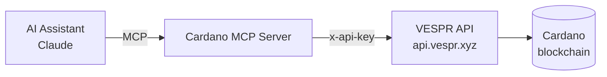

# Cardano MCP

**Cardano MCP** is a [Model Context Protocol](https://modelcontextprotocol.io) server that gives AI assistants (Claude Code, Claude Desktop, and any MCP-compatible client) live, read-only access to the Cardano blockchain through the [VESPR API](https://vespr.xyz).

Ask your assistant things like _"What's the balance of this wallet in USD?"_ or _"What's SNEK trading at right now?"_ and it will call the appropriate tool, fetch live data, and answer.

## What you get

* **Wallet data** — balances, portfolio value in 160+ currencies, transaction history, staking status & rewards.
* **Token & market data** — price, market cap, supply, risk rating, OHLCV charts, trending tokens.
* **On-chain lookups** — CIP-25/CIP-68 asset metadata, batch asset summaries, ADA handle resolution, stake pool metrics.

All 11 tools are listed in [Available Tools](tools.md).

## Two ways to connect

| Client | Transport | What you need |
| --- | --- | --- |
| **Claude Code** & modern MCP clients | Streamable HTTP | Just the hosted URL — `https://mcp.vespr.xyz` |
| **Claude Desktop** | stdio (subprocess) | `npx` + a VESPR API key |


**Why two transports?** Claude Desktop only speaks stdio (it launches the server as a local subprocess). Claude Code and newer clients support the [MCP Streamable HTTP](https://modelcontextprotocol.io/specification/2025-03-26/basic/transports) spec and connect to the hosted server over HTTPS with zero installation.


## The fastest start

Add this to your project's `.mcp.json` (Claude Code):

```json
{
  "mcpServers": {
    "cardano": {
      "type": "http",
      "url": "https://mcp.vespr.xyz"
    }
  }
}
```

No API key, no install. See [Setup & Installation](getting-started.md) for every option, or jump to [Connect with Claude](connect-claude.md).

## How the pieces fit together



The MCP server is a thin, typed proxy: it exposes Cardano data as MCP tools and forwards each call to the VESPR API. Read the full picture in [How It Works](how-it-works.md).
