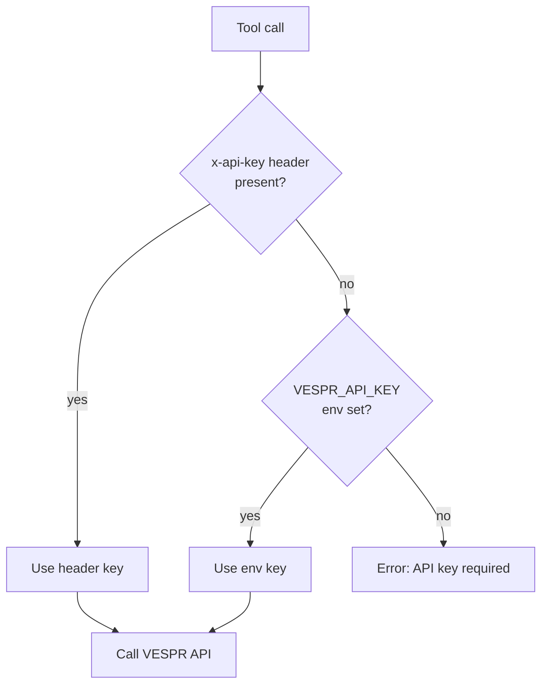

# Authentication & API Keys

Cardano MCP does not have its own user accounts or login. Authentication is entirely about one thing: **the VESPR API key it uses to call `api.vespr.xyz` on your behalf.**

Every tool call ultimately becomes an authenticated request to the VESPR API, sent with an `x-api-key` header. The only question is _where that key comes from_.

## Where the key comes from

The server resolves the key in this order of precedence:

1. **Per-request header** — the `x-api-key` header on the incoming HTTP request (HTTP mode only).
2. **Environment variable** — the `VESPR_API_KEY` set when the server process started.

If neither is present, the call fails with:

> `VESPR API key is required. Provide it via X-API-Key header (HTTP) or VESPR_API_KEY environment variable (stdio/npx).`



In HTTP mode the incoming header key is stored in an `AsyncLocalStorage` context for the duration of that request, so concurrent requests from different clients each use their own key safely.

## What this means per setup

### Hosted server (`mcp.vespr.xyz`) — no key needed

The hosted instance already has a `VESPR_API_KEY` configured server-side. When you connect over Streamable HTTP **without** sending an `x-api-key` header, the server falls back to its own key. This is why the hosted option in [Setup & Installation](getting-started.md) requires no key from you.

```json
{
  "mcpServers": {
    "cardano": {
      "type": "http",
      "url": "https://mcp.vespr.xyz"
    }
  }
}
```

### NPX / Claude Desktop (stdio) — key via environment

stdio mode has no HTTP headers, so the key **must** come from the `VESPR_API_KEY` environment variable. Set it in the `env` block of your client config:

```json
{
  "mcpServers": {
    "cardano": {
      "command": "npx",
      "args": ["-y", "github:vespr-wallet/cardano_mcp"],
      "env": {
        "VESPR_API_KEY": "your-api-key-here"
      }
    }
  }
}
```

### Self-hosted HTTP — key via environment or per-request header

When you run your own HTTP instance you have two choices:

* **Server-side key (like the hosted setup):** set `VESPR_API_KEY` on the server. Clients connect with no header. Simplest for a trusted, private deployment.

  ```bash
  SERVER_MODE=http VESPR_API_KEY=your-key node dist/index.js
  ```

* **Per-client key:** leave `VESPR_API_KEY` unset on the server and require each client to send its own `x-api-key` header. Useful if different clients should use different VESPR keys.

  ```json
  {
    "mcpServers": {
      "cardano": {
        "type": "http",
        "url": "http://localhost:3000",
        "headers": {
          "x-api-key": "${VESPR_API_KEY}"
        }
      }
    }
  }
  ```


If both are present, the **header wins** for that request and the env key is the fallback.


## Getting a VESPR API key

You only need your own key for the NPX and self-hosted options. Contact [VESPR](https://vespr.xyz) to obtain one.

## Security notes

* **Never commit your key.** Use environment variables or your client's secret storage. The repo ships a `.env.example` as a template — copy it to `.env` (which is git-ignored) for local self-hosting.
* **The key is only ever sent to `api.vespr.xyz`** (configurable via `VESPR_API_URL`) over HTTPS, as an `x-api-key` header.
* **CORS** is locked down by default in HTTP mode: cross-origin browser requests are rejected unless their origin is in `ALLOWED_ORIGINS`. This prevents a malicious website from driving your local server. See [Configuration](configuration.md).
* **Rate limiting** is per-IP and on by default in HTTP mode, providing a basic abuse guard independent of the key.
* **Logs never print the key.** The API key is not included in any structured log output.
