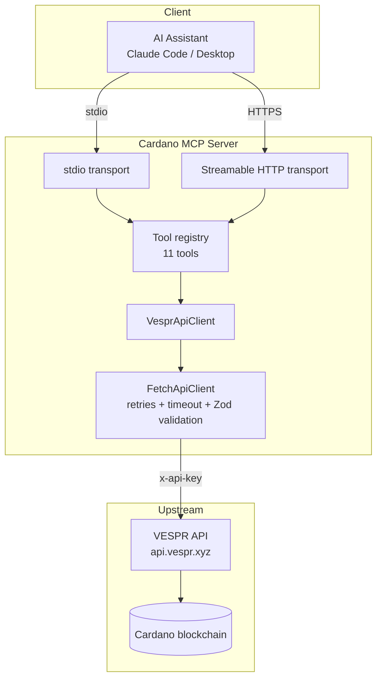
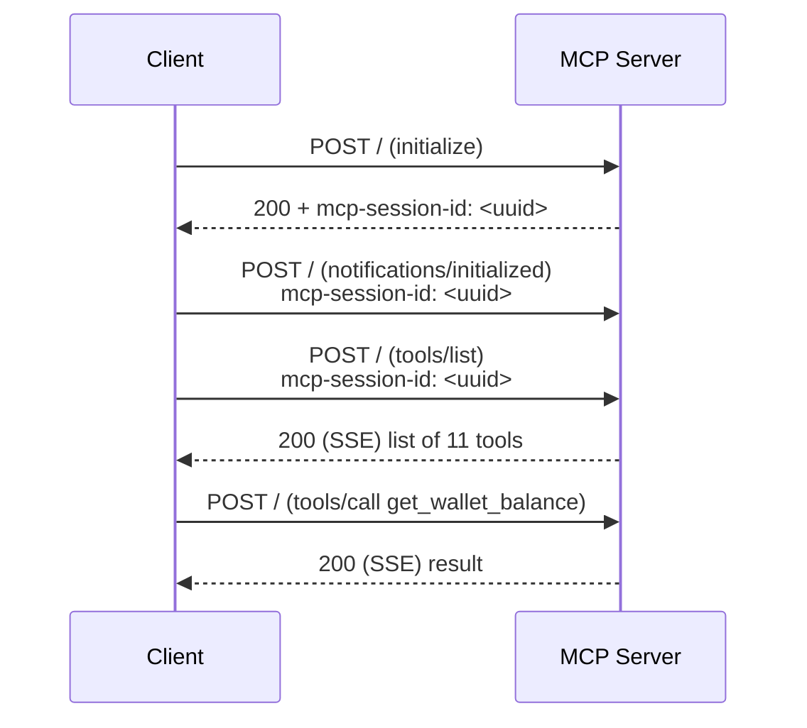

# How It Works

Cardano MCP is a thin, strongly-typed **proxy** between an AI assistant and the [VESPR API](https://vespr.xyz). It speaks the Model Context Protocol on one side and VESPR's REST API on the other.

## Architecture at a glance



Every tool call follows the same path: the transport receives an MCP request, the registry routes it to the matching tool handler, the handler validates inputs, calls `VesprApiClient`, which forwards an authenticated request to VESPR through a resilient HTTP client that validates the response against a [Zod](https://zod.dev) schema before returning it.

## Transports

The server can run in three modes, selected with the `SERVER_MODE` environment variable.

| Mode | Value | Used by | Description |
| --- | --- | --- | --- |
| **stdio** | `stdio` (default) | Claude Desktop | Runs as a subprocess; communicates over stdin/stdout. |
| **HTTP** | `http` | Claude Code, web clients | Listens on a port and serves the MCP Streamable HTTP transport plus a REST interface. |
| **both** | `both` | Local development | Runs stdio and HTTP simultaneously. |


stdout is reserved for the MCP protocol in stdio mode. All logs are written to **stderr** so they never corrupt the protocol stream.


### stdio transport

When `SERVER_MODE` is `stdio` (the default), `index.ts` creates an `McpServer`, registers all tools, and connects it to a `StdioServerTransport`. The assistant launches the process and exchanges JSON-RPC messages over the pipe. This is what Claude Desktop uses.

### Streamable HTTP transport

When `SERVER_MODE` is `http`, a [Fastify](https://fastify.dev) server is started and exposes the MCP endpoint at the **root path `/`** with three methods:

| Method | Path | Purpose |
| --- | --- | --- |
| `POST` | `/` | Initialize a session and send JSON-RPC messages. |
| `GET` | `/` | Open the server-sent-events (SSE) stream for an existing session. |
| `DELETE` | `/` | Terminate a session. |

Sessions are tracked by the `mcp-session-id` header:

1. The first `POST /` (an `initialize` request) creates a session. The server generates a UUID and returns it in the `mcp-session-id` response header.
2. Subsequent requests must include that `mcp-session-id` header. Unknown or expired IDs return `404`.
3. Idle sessions are evicted after `SESSION_TTL_MS` (default 1 hour). A cleanup sweep runs every 60 seconds.



### REST interface (bonus)

Alongside the MCP transport, the HTTP server also exposes a plain REST API — handy for testing or non-MCP integrations:

| Method | Path | Purpose |
| --- | --- | --- |
| `GET` | `/tools` | List all tools and their input schemas. |
| `POST` | `/tools/:toolName` | Execute a tool with a JSON `{ "arguments": { ... } }` body. |
| `GET` | `/health` | Liveness probe (exempt from rate limiting). |

Example:

```bash
curl -X POST http://localhost:3000/tools/get_supported_currencies \
  -H "Content-Type: application/json" \
  -H "x-api-key: $VESPR_API_KEY" \
  -d '{"arguments":{}}'
```

## Request lifecycle

1. **Input validation.** Each tool validates its arguments with a Zod schema. Cardano addresses are additionally checked for valid bech32 format before any network call — invalid input returns a tool error immediately, with no upstream request.
2. **Authentication context.** In HTTP mode the per-request `x-api-key` header is stored in an `AsyncLocalStorage` context so the right key is used even under concurrent requests. See [Authentication & API Keys](authentication.md).
3. **Upstream call.** `VesprApiClient` builds the VESPR request, attaching the API key as an `x-api-key` header.
4. **Resilience.** `FetchApiClient` enforces a request timeout (`REQUEST_TIMEOUT_MS`, default 30s) and retries transient failures (HTTP `5xx` and `429`) with exponential backoff up to `MAX_RETRIES` (default 3).
5. **Response validation.** The upstream JSON is parsed and validated against a Zod schema. Malformed responses raise a typed `VesprApiError` rather than leaking bad data to the model.
6. **Shaping.** The handler transforms the raw response into both a human-readable `text` summary and a `structuredContent` object that matches the tool's declared output schema.

## Resilience & limits

* **Retries:** up to `MAX_RETRIES` attempts on `5xx`/`429`, backoff = `RETRY_BASE_DELAY_MS × 2^attempt`.
* **Timeouts:** each upstream request is aborted after `REQUEST_TIMEOUT_MS`.
* **Rate limiting (HTTP mode):** per-IP limits of `RATE_LIMIT_PER_MINUTE` (default 10) and `RATE_LIMIT_PER_DAY` (default 250). `/health` is exempt. Exceeding a limit returns `429`.
* **CORS (HTTP mode):** cross-origin browser requests are denied unless the origin is listed in `ALLOWED_ORIGINS`.

All of these are tunable — see [Configuration](configuration.md).
